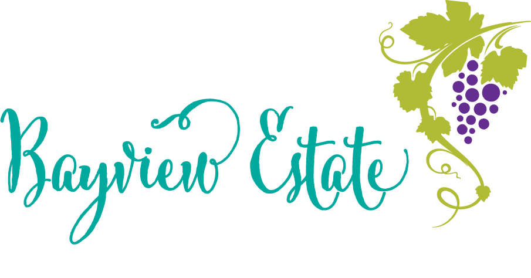

# Bayview Hub Visual Style Guide

> Apply this system to gallery.bayviewhub.me for consistent "Bayview luxury minimal" branding.



---

## 1. Overview

**Goal:** "Bayview luxury minimal" — Inter body + Cormorant Garamond serif headings, cream background, gray-teal accent, high readability.

**Non-goals:** No logic/content changes. This is a visual system only.

---

## 2. Typography

### Font setup (next/font/google)

Configured in `app/layout.tsx`:

```ts
import { Inter, Cormorant_Garamond } from 'next/font/google'

const inter = Inter({
  subsets: ['latin'],
  variable: '--font-sans',
  display: 'swap',
})

const cormorant = Cormorant_Garamond({
  subsets: ['latin'],
  weight: ['400', '500', '600'],
  variable: '--font-serif',
  display: 'swap',
})
```

Applied on `<html>`: `className={`${inter.variable} ${cormorant.variable} font-sans`}`

### CSS variable names

| Variable       | Purpose              |
|----------------|----------------------|
| `--font-sans`  | Body text (Inter)     |
| `--font-serif` | Headings (Cormorant)  |

### Type scale

| Element   | px (approx) | Tailwind classes                    | Usage                    |
|-----------|-------------|-------------------------------------|--------------------------|
| H1        | 35–56       | `text-5xl md:text-7xl font-serif font-extrabold` | Hero titles              |
| H2        | 24–32       | `text-4xl md:text-5xl font-serif font-bold`      | Section titles           |
| H3        | 20–24       | `text-2xl font-serif font-bold`                  | Card titles, subsections |
| H4        | 16–18       | `text-lg font-semibold` or `text-base font-semibold` | Footer headings, labels |
| Body      | 16          | `text-base` (default)               | Paragraphs               |
| Small/nav | 12–13       | `text-sm` or `text-xs`              | Labels, nav, metadata    |
| Button    | 14–18       | `text-sm` / `text-base` / `text-lg` | Via Button sizes sm/md/lg |

### Readability rules

- **Headings:** `text-fg`
- **Body / descriptions:** `text-muted`
- **Small labels, secondary links:** `text-subtle`
- **Avoid:** Opacity-based text colors (e.g. `text-white/70`) — use semantic tokens instead

---

## 3. Color system (single source of truth)

### CSS tokens from `app/globals.css`

#### Light theme (`:root`)

| Token         | Value     | Description                    |
|---------------|-----------|--------------------------------|
| `--bg`        | `#FAFAF8` | Page background (cream)        |
| `--surface`   | `#FFFFFF` | Cards, panels                  |
| `--fg`        | `#111827` | Primary text                  |
| `--muted`     | `#374151` | Secondary text                |
| `--subtle`    | `#4B5563` | Tertiary text, labels         |
| `--border`    | `#E5E7EB` | Borders                       |
| `--accent`    | `#5EB1BF` | Teal accent (buttons, links)  |
| `--accent-hover` | `#3D8A96` | Accent hover state         |
| `--accent-soft`  | `#A8D5DD` | Soft accent backgrounds    |

#### Dark theme (`.dark`)

| Token         | Value     | Description                    |
|---------------|-----------|--------------------------------|
| `--bg`        | `#0F172A` | Page background (navy)         |
| `--surface`   | `#1E293B` | Cards, panels                  |
| `--fg`        | `#F9FAFB` | Primary text                  |
| `--muted`     | `#D1D5DB` | Secondary text                |
| `--subtle`    | `#9CA3AF` | Tertiary text                 |
| `--border`    | `#334155` | Borders                       |
| `--accent`    | `#7DD3C4` | Teal accent                   |
| `--accent-hover` | `#5EB1BF` | Accent hover               |
| `--accent-soft`  | `#284446` | Soft accent backgrounds    |

### Tailwind mapping (`tailwind.config.ts`)

```ts
colors: {
  bg: 'var(--bg)',
  fg: 'var(--fg)',
  muted: { DEFAULT: 'var(--muted)', foreground: 'var(--muted)' },
  subtle: 'var(--subtle)',
  border: 'var(--border)',
  surface: 'var(--surface)',
  accent: {
    DEFAULT: 'var(--accent)',
    hover: 'var(--accent-hover)',
    50: 'var(--accent-soft)',
    // ... 100–900 also map to accent tokens
  },
  primary: {
    DEFAULT: 'var(--fg)',
    foreground: 'var(--bg)',
    600: 'var(--accent)',   // primary-600 = accent
    700: 'var(--accent-hover)',
    // ...
  },
  natural: {
    50: 'var(--bg)',
    100: '#f5f5f3',
    200: 'var(--border)',
    300: 'var(--subtle)',
    400–600: 'var(--muted)',
    700: '#374151',
    800: '#171717',
    900: 'var(--fg)',
  },
}
```

**Dark mode:** `darkMode: 'class'` — add `dark` to `<html>` for dark theme.

---

## 4. Component rules

### Card

- Default: `border border-border`, `rounded-2xl`, `bg-white` (light) / `dark:bg-surface dark:border-border`
- Hover: `hover:border-accent`
- No heavy shadows; use `shadow-lg` sparingly
- Highlight variant: `ring-1 ring-accent`
- Title: `text-fg`; description: `text-muted`

### Button

| Variant   | Styles                                                                 |
|-----------|------------------------------------------------------------------------|
| primary   | `bg-primary-600 text-white hover:bg-primary-700` (maps to accent)      |
| secondary | `bg-primary-800 text-white hover:bg-primary-900`                       |
| accent    | `bg-accent text-white hover:bg-accent-hover`                            |
| outline   | `border border-border text-fg hover:bg-fg hover:text-bg`                |

Sizes: `sm` (px-4 py-2 text-sm), `md` (px-6 py-3 text-base), `lg` (px-8 py-4 text-lg)

### Footer

- Headings: `text-fg`
- Links: `text-muted hover:text-fg`
- Body text: `text-muted`
- No opacity-based text colors

### Header / Logo (contrast-critical)

The header logo text ("Bayview Hub", "Est. Victoria") and hamburger menu icon must remain readable on both light and dark backgrounds. Use **`useTheme()` from `next-themes` + inline styles** to bypass CSS cascade overrides (e.g. `.dark span` in globals.css):

- **Logo** (`components/ui/Logo.tsx`): Client component using `useTheme()`. Light mode: `#111827` (title), `#374151` (subtitle). Dark mode: `#F9FAFB`, `#D1D5DB`. Apply via `style={{ color: ... }}`.
- **Hamburger button** (`components/layout/Header.tsx`): Same pattern. Button uses `style={{ color: iconColor }}`; Lucide icons inherit `currentColor`.
- **Why inline styles:** Global rules like `.dark span { color: var(--fg) }` can override Tailwind classes. Inline styles have highest specificity and cannot be overridden by external CSS.

---

## 5. Pages touched (changelog summary)

Key files adjusted to reach current style:

- `app/globals.css` — CSS tokens, base typography, dark theme
- `app/layout.tsx` — next/font setup (Inter + Cormorant Garamond)
- `tailwind.config.ts` — color/font mappings
- `components/ui/Card.tsx` — border, hover, ring-accent
- `components/ui/Button.tsx` — variants (primary/accent/outline)
- `components/layout/Footer.tsx` — text-fg headings, text-muted links
- `components/layout/Header.tsx` — sticky header, useTheme + inline styles for hamburger
- `components/ui/Logo.tsx` — useTheme + inline styles for logo text (bypass CSS override)
- `app/page.tsx` — pre-launch notice, experiences grid
- `app/zh/page.tsx` — Chinese homepage contrast fixes
- `components/seo/AnswerCapsule.tsx` — text tokens
- `components/ui/NewsletterForm.tsx` — form labels
- `components/ui/PrelaunchButton.tsx` — modal text
- `components/social/ReviewsWidget.tsx` — card backgrounds

---

## 6. Logo asset

### Source

- **Path:** `public/images/bayview-estate-logo.jpg`
- **Referenced in:** `components/ui/Logo.tsx` via `<Image src="/images/bayview-estate-logo.jpg" />`
- **Also used:** `app/art-gallery/founding-partners/page.tsx`

### Logo usage

- **Max height in header:** `h-16` (mobile), `md:h-20` (desktop)
- **Aspect:** `width={200} height={60}`, `w-auto` to preserve ratio
- **Background:** Header uses `bg-white/95` (light) / `dark:bg-surface/90` (dark)
- **Text beside logo:** "Bayview Hub" + "Est. Victoria" — use `useTheme()` from `next-themes` and inline `style={{ color: ... }}`:
  - Light mode: `#111827` (title), `#374151` (subtitle)
  - Dark mode: `#F9FAFB` (title), `#D1D5DB` (subtitle)
- **Hamburger icon:** Same pattern — `style={{ color: iconColor }}` on the button; icons inherit `currentColor`

---

## 7. Apply to gallery.bayviewhub.me — checklist

- [ ] Copy `next/font` setup from `app/layout.tsx` (Inter + Cormorant Garamond)
- [ ] Copy CSS tokens from `app/globals.css` (`:root` and `.dark`)
- [ ] Map Tailwind colors in `tailwind.config.ts`: `bg`, `fg`, `muted`, `subtle`, `border`, `surface`, `accent`
- [ ] Map fontFamily: `sans: ['var(--font-sans)', ...]`, `serif: ['var(--font-serif)', ...]`
- [ ] Set `darkMode: 'class'` in Tailwind config
- [ ] Verify key pages (`/`, `/masterpieces`, `/study`, `/protocol`) for contrast:
  - Headings use `text-fg`
  - Body uses `text-muted`
  - No low-contrast `text-muted` on dark backgrounds (use `text-fg` where needed)
- [ ] Cards: `border-border`, `hover:border-accent`, `dark:bg-surface` (not `dark:bg-surface/60`)
- [ ] Buttons: primary = accent; outline = border-border, hover:bg-fg hover:text-bg
- [ ] Header/Logo: Use `useTheme()` + inline styles for logo text and hamburger icon (see §4 Header/Logo)
- [ ] Run `npm run build` and fix any missing token references
